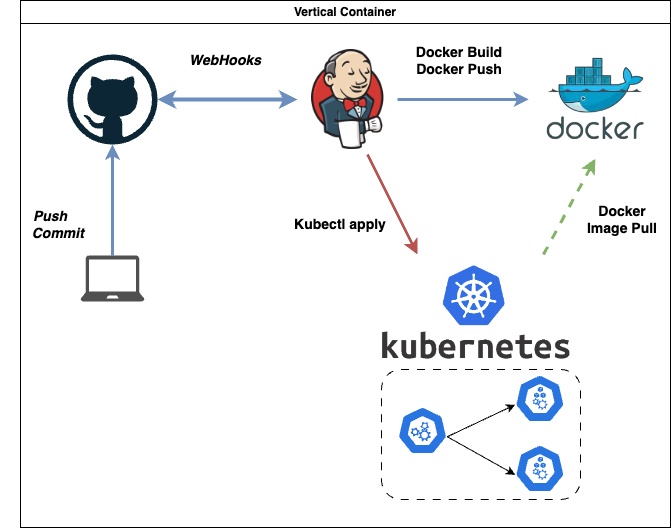

# Implementación de una aplicación SpringBoot en Amazon EKS mediante GitHub, Jenkins, Maven y Docker
¿Quieres desplegar tu aplicación en AWS? ¿O simplemente quiere tener una idea de cómo se puede automatizar el lanzamiento de tu aplicación mediante la integración continua/entrega continua con las últimas herramientas de DevOps?
Con el siguiente articulo te pondras al día sobre cómo configurar una canalización de CI/CD en AWS.
Te indicaremos todo los pasos necesarios para hacer un despliegue automatico.
## Badges

            

        

## Contributing

Contributions are always welcome!

See `readme.md` for ways to get started.

Please adhere to this project's `code of conduct`.

## Diagrama Proyecto

## Feedback

If you have any feedback, please reach out to us at c.caldas.m@gmail.com